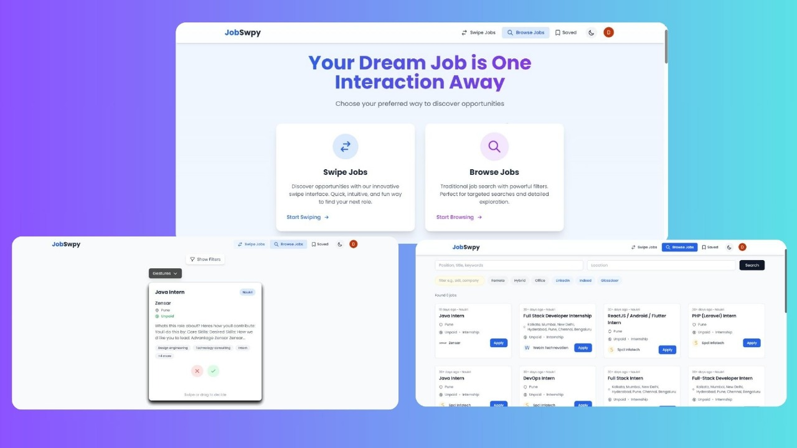
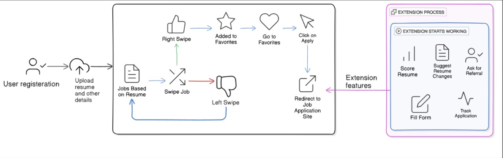
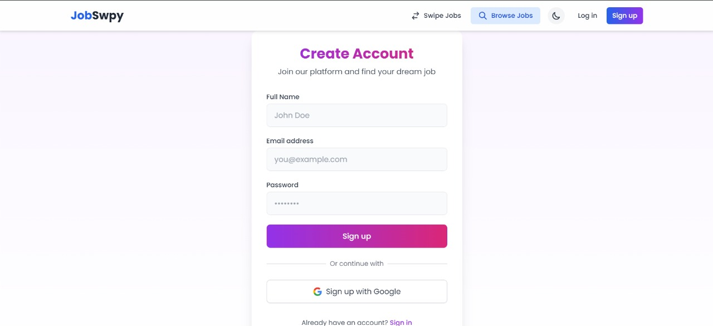
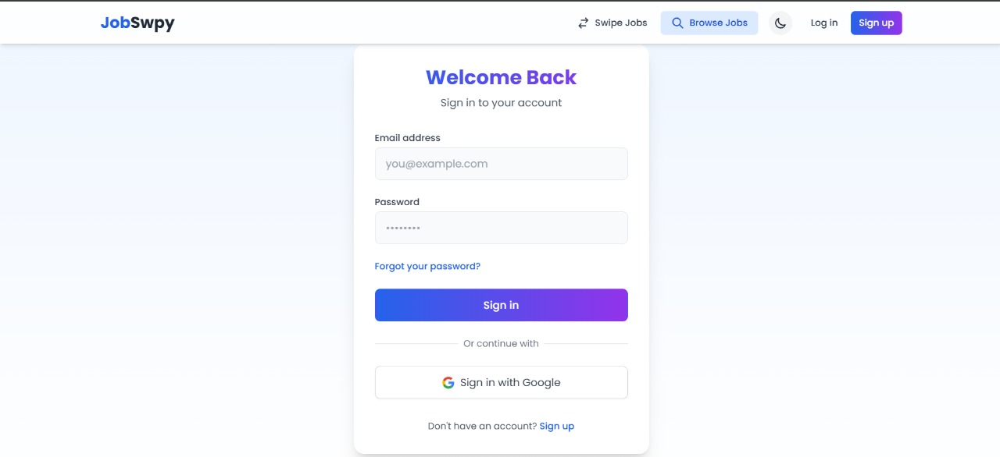
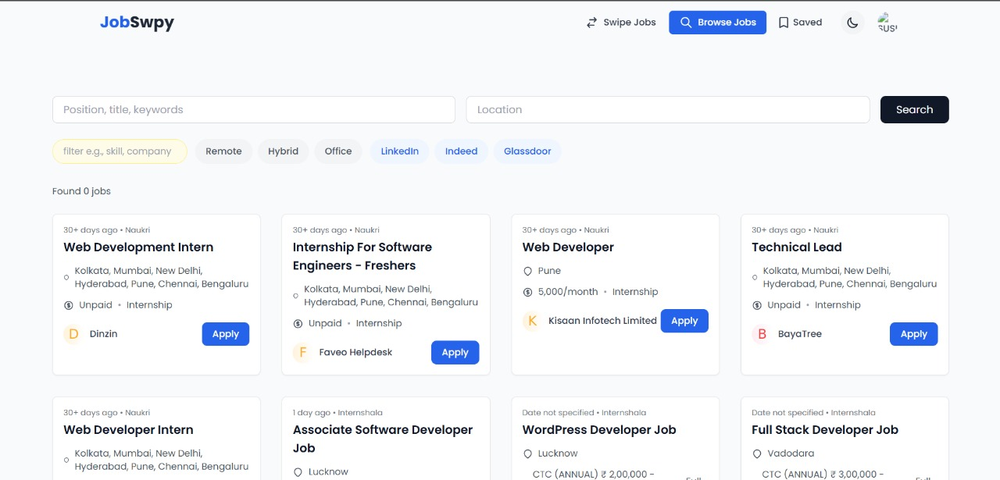
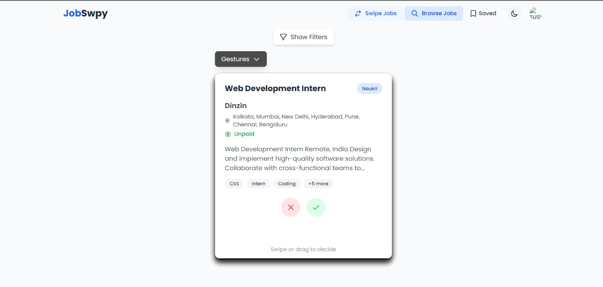
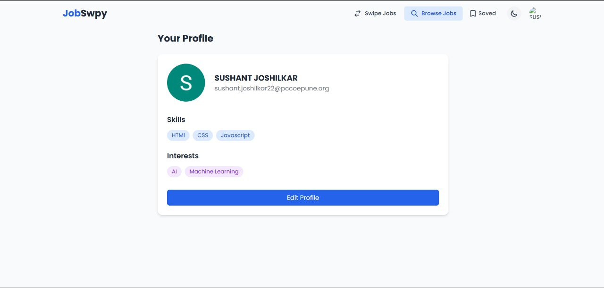
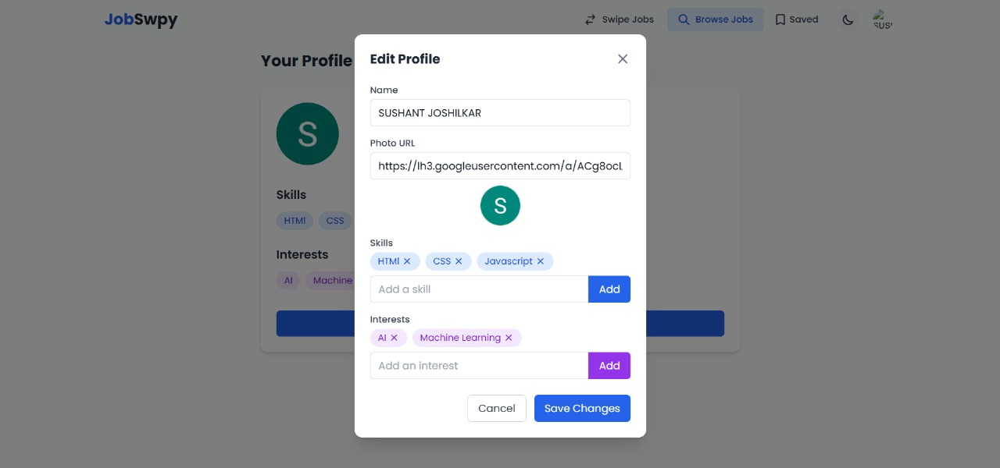

# Jobswpy

## PS7 Unified Job & Internship Aggregator
## Problem Statement
Job seekers often struggle to browse multiple platforms like LinkedIn, Wellfound, and Indeed to find relevant opportunities. The goal is to develop a centralized application that aggregates job and internship listings from various sources using web crawling techniques, saving time and effort for users.



## What is Jobswpy?
Jobswpy is a job portal that aggregates job listings from various platforms like Naukri.com, Indeed, and LinkedIn. Users can upload their resumes, browse jobs based on their skills and interests, and receive personalized job notifications. Jobswpy simplifies the job search process by providing a seamless interface for job seekers to find and apply for suitable opportunities.

## How We Solve the Problem
1. *Job Scraping* - Jobs are collected from multiple platforms like Naukri.com, Indeed, and LinkedIn.
2. *Resume Upload* - Users can upload their resumes, which are used to match them with relevant job opportunities.
3. *Personalized Job Browsing* - Users can filter and browse jobs based on their skills and interests.
4. *Job Notifications* - Users receive real-time job alerts matching their preferences.
5. *Easy Job Applications* - Users can apply for jobs directly through the platform.
6. *Tinder-Like Job Browsing* - Users can swipe left to dismiss a job and swipe right to save it for later.
7. *Google & Email Login* - Users can log in using Google authentication or sign up with an email and password.
8. *Advanced Job Filters* - Users can filter jobs by category, location, salary range, and more.


## Inspiration
Searching for jobs across multiple platforms can be time-consuming and inefficient. Jobswpy addresses this challenge by aggregating job listings and providing personalized recommendations. By leveraging automation and smart filtering, we streamline the job search process for job seekers, making it easier to find relevant opportunities.

## What It Does
Jobswpy is a job portal that simplifies job searching through automation and smart recommendations:

- *Aggregates Job Listings* - Collects jobs from platforms like Naukri, Indeed, and LinkedIn.
- *Personalized Recommendations* - Matches job seekers with relevant opportunities based on skills and interests.
- *Job Notifications* - Sends real-time job alerts tailored to user preferences.
- *Resume Upload* - Allows users to store and manage resumes for quick applications.
- *Seamless Job Application* - Enables users to apply for jobs with one click.
- *Tinder-Like Swiping Feature* - Users can easily save or dismiss job listings with a swipe.
- *Google & Email Authentication* - Easy sign-up and login options for users.
- *Advanced Filtering* - Users can browse jobs using filters for better search results.

## User Access
Users can sign up and log in to the platform using Google authentication or email and password to browse and apply for jobs.
## Signup and Login



### Job Seeker Dashboard
- Upload and manage resumes.
- Browse job listings based on skills and interests.
- Receive job notifications.
- Apply for jobs directly through the platform.
- Swipe left to reject jobs and swipe right to save them.
- Use advanced filters to find jobs that match their preferences.

## Browse Jobs


## Swipe Jobs


## Dashboard
After login, users access their personalized dashboards:
## User Dashboard




## 🧭 Tech Stack
### Frontend:
- React.js
- Tailwind CSS
- Daisy UI

### Backend:
- Node.js
- Express.js
- MongoDB
- JWT Authentication
- Web Scraping (Puppeteer / Scrapy)

## ✨ Key Features
### For Job Seekers:
- Browse and filter jobs based on skills and interests.
- Upload and manage resumes.
- Get real-time job notifications.
- Apply for jobs directly through the platform.
- Swipe left to dismiss jobs and right to save them.
- Sign in using Google or email/password.


## 🚀 Getting Started Locally
### 1. Clone the Repository
git clone https://github.com/Anuj5504/TLE-BlueBit.git

cd jobswpy


### 2. Configure Environment Variables in Backend 
Create a .env file in the root directory and include the following:
sh
MONGO_URI=your_mongodb_uri
JWT_SECRET=your_jwt_secret
SCRAPER_API_KEY=your_scraper_api_key
EMAIL_USER=your_email
EMAIL_PASS=your_email_pass
PORT=5000
GOOGLE_CLIENT_ID=your_google_client_id
GOOGLE_CLIENT_SECRET=your_google_client_secret


### 3. Configure Environment Variables in Frontend

VITE_API_URL=http://localhost:5000

VITE_FIREBASE_API_KEY=YOUR_FIREBASE_API_KEY
VITE_FIREBASE_AUTH_DOMAIN=YOUR_FIREBASE_AUTH_KEY
VITE_FIREBASE_PROJECT_ID=YOUR_FIREBASE_PROJECT_ID
VITE_FIREBASE_STORAGE_BUCKET=YOURFIREBASE_STORAGE_BUCKET
VITE_FIREBASE_MESSAGING_SENDER_ID=YOUR_FIREBASE_MESSAGING_SENDER_ID
VITE_FIREBASE_APP_ID=YOUR_FIREBASE_APP_ID


### 4. Backend Setup
```sh
cd backend   
npm install
npm run start
```


Ensure all dependencies are installed. If errors occur, double-check your environment and installed packages.

### 5. Frontend Setup
```sh
cd frontend
npm install
npm run dev
```


### 6. Launch the Application
Visit the following URL in your browser: [http://localhost:5173/](http://localhost:5173/)