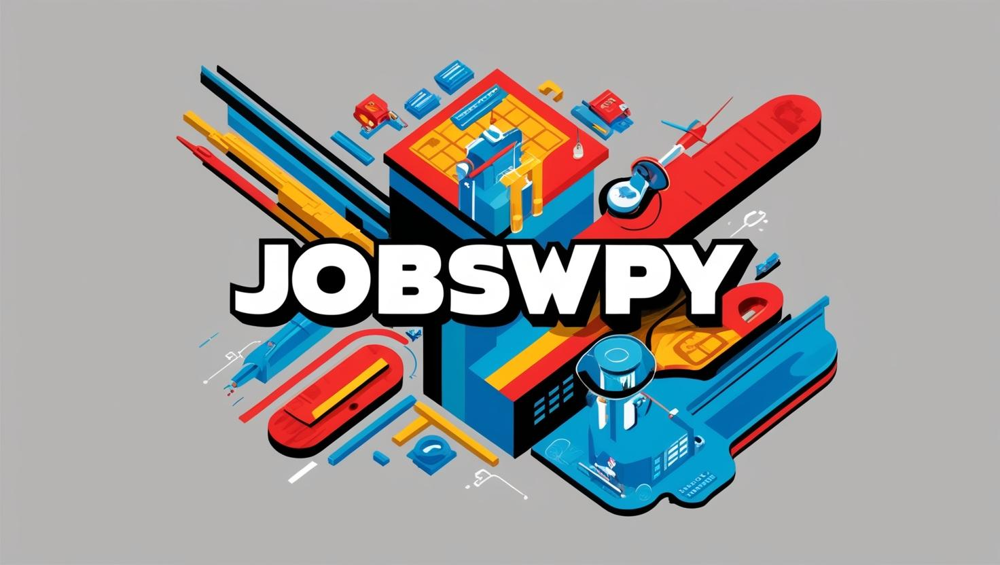
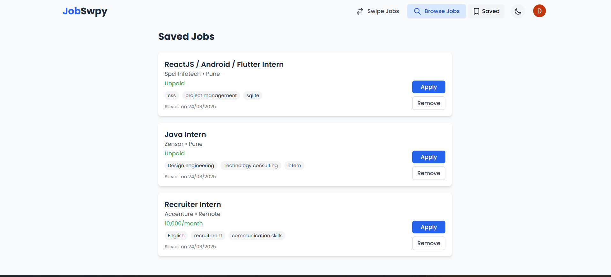
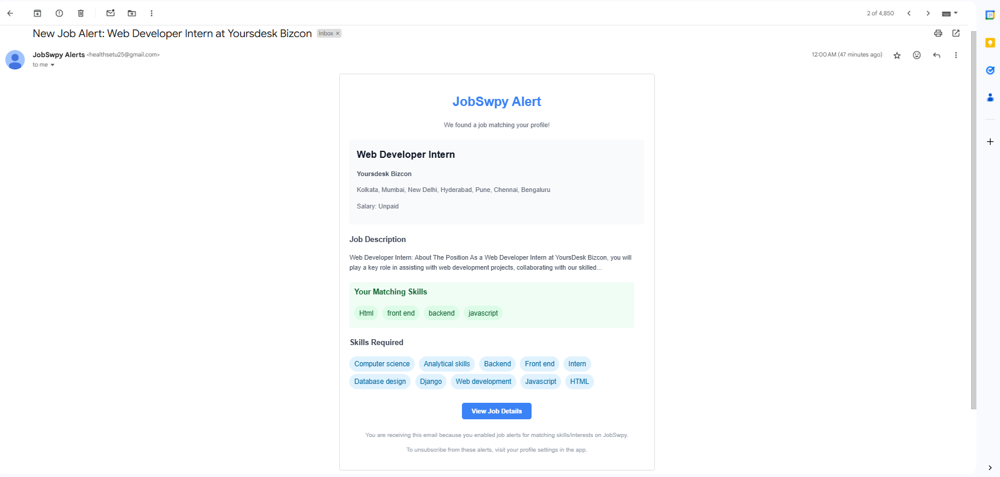

#  Jobswpy - Smart Job Search, Simplified

[](https://reactjs.org/)
[](https://nodejs.org/)
[](https://www.mongodb.com/)
[](https://tailwindcss.com/)

## 🚀 PS7: Unified Job & Internship Aggregator with AI-Powered Features

### 🔍 Problem Statement
Job seekers waste countless hours browsing multiple platforms like LinkedIn, Wellfound, Indeed, and Naukri to find relevant opportunities. Our solution is a centralized application that aggregates job and internship listings using advanced web crawling and AI technologies, saving users time and effort.


## ✨ What is Jobswpy?

Jobswpy is an intelligent job portal that revolutionizes the job search process by:

- 🔍 **Aggregating job listings** from multiple platforms (Naukri, Indeed, LinkedIn, Glassdoor)
- 📊 **Providing AI-powered recommendations** based on user skills and preferences
- 📱 **Offering a Tinder-like swiping interface** for quick job browsing
- 🤖 **Featuring an AI Chrome Extension** that auto-fills job applications using resume data
- 📫 **Delivering personalized job alerts** via email and notifications
- 📄 **Analyzing resume data** to suggest skill improvements and matching jobs
- 👥 **Community features** for networking, discussions, and knowledge sharing
- 🗺️ **Interactive developer roadmaps** to guide career progression

## 🎯 How We Solve the Problem

### Core Features:
1. **🕸️ Intelligent Job Scraping**
   - Real-time job collection from multiple platforms
   - Advanced filtering and categorization of listings

2. **📄 Smart Resume Analysis**
   - Extract skills, experience, and qualifications automatically
   - Match with relevant job requirements
   - Suggest improvements for better job matches

3. **🧠 AI-Powered Matching Algorithm**
   - Personalized job recommendations based on skills and interests
   - Learning from user interactions to improve suggestions

4. **👆 Intuitive User Experience**
   - Tinder-like swiping interface for quick job evaluation
   - Advanced filtering options for precise job searches
   - Clean, responsive design for all devices

5. **🔔 Smart Notifications**
   - Real-time alerts for new matching jobs
   - Weekly digest of top opportunities
   - Application deadline reminders

6. **🧩 Chrome Extension: JobSwpy Apply**
   - Auto-fill job applications using resume data
   - Works across multiple job platforms
   - AI-powered form field detection and mapping
   - Time-saving tool for applying to multiple jobs quickly

7. **👥 Developer Community**
   - Discussion forums and topic-based "bowls"
   - Knowledge sharing through polls and threaded conversations
   - Dark mode support for comfortable browsing
   - Interactive developer roadmaps for career planning


## 💡 Inspiration

The job search process is fragmented, time-consuming, and often frustrating. After experiencing these challenges firsthand, we created Jobswpy to unify the job search experience and leverage AI to make it more efficient and personalized.

## 🛠️ What It Does

### For Job Seekers:

- **🔄 One-Stop Platform**: Access jobs from multiple sources in a single interface
- **🎯 Personalized Recommendations**: Receive job matches based on your unique profile
- **⚡ Quick Application**: Apply to jobs with one click using stored profile information
- **👆 Swipe Interface**: Easily save or dismiss job listings with simple gestures
- **🔍 Advanced Filtering**: Find exactly what you're looking for with powerful search options
- **📊 Career Insights**: Gain visibility into job market trends and in-demand skills
- **🤖 AI Form Filling**: Our Chrome extension automatically fills out job applications using your resume data
- **👥 Community Support**: Connect with other job seekers, share experiences, and get advice
- **🗺️ Career Roadmaps**: Follow visual learning paths for different tech career tracks

## 🔐 User Access

Sign up and log in using:
- Google Single Sign-On
- Email and password

### Authentication Screens
<div style="display: flex; gap: 20px;">
  
  
</div>

## 📱 Key Features

### Browse Jobs with Powerful Filters


### Tinder-Like Job Swiping Interface


### Saved Jobs Management


### Community & Developer Resources
- Discussion forums organized by topics
- Interactive developer roadmaps with learning resources
- Dark mode support for comfortable browsing
- Polls and community engagement tools

### Personalized Dashboard
<div style="display: flex; gap: 20px;">
  
  
</div>

### AI-Powered Email Recommendations


### 🧩 JobSwpy Apply Chrome Extension
Our Chrome extension supercharges your job applications:

- **🤖 AI Form Detection**: Automatically identifies form fields on job application pages
- **📄 Resume Parsing**: Extracts relevant information from your uploaded resume
- **⚡ One-Click Fill**: Populates application forms with your information in seconds
- **🔄 Cross-Platform Support**: Works on LinkedIn, Indeed, Glassdoor, and company career pages
- **🔐 Privacy-Focused**: Your data never leaves your browser

<!--  -->

## 🧰 Tech Stack

### Frontend:
- ⚛️ React.js
- 🎨 Tailwind CSS
- 🧩 Daisy UI
- 🔄 Framer Motion
- 📊 React Flow (for interactive roadmaps)

### Backend:
- 🟢 Node.js
- 🚂 Express.js
- 🍃 MongoDB
- 🔐 JWT Authentication
- 🕸️ Web crawlers (multiple job platforms)
- 🤖 AI recommendation engine

### Chrome Extension:
- ⚛️ React
- 🧠 TensorFlow.js for form field detection
- 🔄 RESTful API integration with main platform

## 🚀 Getting Started Locally

### 1. Clone the Repository
```bash
git clone https://github.com/Anuj5504/TLE-BlueBit.git
cd TLE-BlueBit
```

### 2. Configure Backend Environment Variables
Create a `.env` file in the backend directory:
```
MONGO_URI=your_mongodb_uri
JWT_SECRET=your_jwt_secret
SCRAPER_API_KEY=your_scraper_api_key
EMAIL_USER=your_email
EMAIL_PASS=your_email_pass
PORT=5000
GOOGLE_CLIENT_ID=your_google_client_id
GOOGLE_CLIENT_SECRET=your_google_client_secret
```

### 3. Configure Frontend Environment Variables
Create a `.env` file in the frontend directory:
```
VITE_API_URL=http://localhost:5000
VITE_FIREBASE_API_KEY=YOUR_FIREBASE_API_KEY
VITE_FIREBASE_AUTH_DOMAIN=YOUR_FIREBASE_AUTH_KEY
VITE_FIREBASE_PROJECT_ID=YOUR_FIREBASE_PROJECT_ID
VITE_FIREBASE_STORAGE_BUCKET=YOURFIREBASE_STORAGE_BUCKET
VITE_FIREBASE_MESSAGING_SENDER_ID=YOUR_FIREBASE_MESSAGING_SENDER_ID
VITE_FIREBASE_APP_ID=YOUR_FIREBASE_APP_ID
```

### 4. Backend Setup
```bash
cd backend
npm install
npm run start
```

### 5. Frontend Setup
```bash
cd frontend
npm install
npm run dev
```

### 6. Chrome Extension Setup
```bash
cd extension
npm install
npm run build
# Then load the 'dist' folder as an unpacked extension in Chrome
```

### 7. Launch the Application
Visit [http://localhost:5173/](http://localhost:5173/) in your browser.

## 📱 Mobile Experience
Jobswpy is fully responsive and provides an excellent experience on mobile devices:

- 📱 Swipe interface optimized for touch screens
- 🔍 Mobile-friendly job search and filtering
- 📣 Push notifications for new matching jobs
- 👥 Community access on the go

## 🔮 Future Features

- 💬 AI Interview preparation with personalized feedback
- 📊 Salary insights and negotiation suggestions
- 🌎 International job search with relocation assistance
- 🎓 Integration with learning platforms for skill development
- 🧠 Advanced AI resume builder with job-specific optimization
- 🤝 Mentor matching within the community

## 🤝 Contributing
We welcome contributions! Please see our [Contributing Guidelines](CONTRIBUTING.md) for more details.

## 📄 License
This project is licensed under the MIT License - see the [LICENSE](LICENSE) file for details.

<p align="center">
  Made with ❤️ by Team TLE
</p>